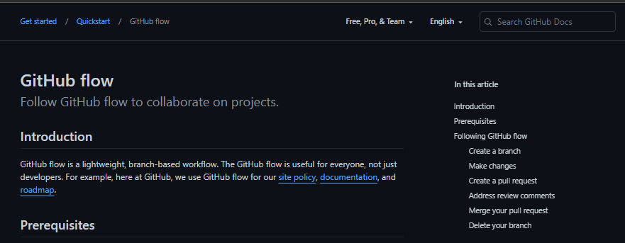
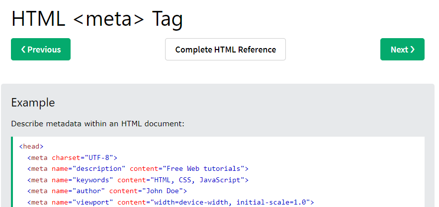
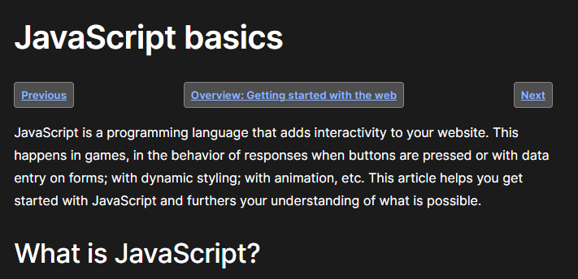

# 03 Challenge: Password Generator

## Description

This application will provide the end user with a password generator solution, allowing them to choose the length and character types to include within the resulting password.

## Table of Contents

- [Website Preview](#application-preview)
- [Site Features](#site-features)
- [Acceptance Criteria](#acceptance-criteria-for-this-challenge)
- [Credits](#credits)
    - [Git Cheat Sheet](#git-cheat-sheet-pdf)
    - [Git Flow Process](#git-flow-process)
    - [HTML Reference](#html-reference)
    - [Java Basics](#java-basics)
    - [Java Data Types](#java-data-types)
- [License](#license)
- [How To Contribute](#how-to-contribute)

# Application Preview

[Password Generator](https://estee3.github.io/03-Challenge/)

## Site Features
- Allows end user to choose length of their new password
- Built-in restrictions for length so that the user will be required to re-enter their lenght if less than 8 or more than 128
- Built-in validation of the user entering an integer and not a character other than numbers
- Allows end user to select one of 4 different types of characters (Numbers, Upper-Case Letters, Lower-Case Letters and Special Characters)
- Built-in validation, requiring the end user to select at least one type of character before continuing
- Alerts the end user to ensure they save the new password within their password keeper of choice.  It even presents a url to do their own reseach in finding one, if they don't already have one.
- Presents the resulting password to the end user, within the area of the application for easy highlight-and-select, allowing for eash copy/paste actions.

## Acceptance Criteria for this Challenge
***GIVEN I need a new, secure password:***
- ***WHEN*** I click the button to generate a password
    - ***THEN*** I am presented with a series of prompts for password criteria
- ***WHEN*** prompted for password criteria
    - ***THEN*** I select which criteria to include in the password
- ***WHEN*** prompted for the length of the password
    - ***THEN*** I choose a length of at least 8 characters and no more than 128 characters
- ***WHEN*** asked for character types to include in the password
    - ***THEN*** I confirm whether or not to include lowercase, uppercase, numeric, and/or special characters
- ***WHEN*** I answer each prompt
    - ***THEN*** my input should be validated and at least one character type should be selected
- ***WHEN*** all prompts are answered
    - ***THEN*** a password is generated that matches the selected criteria
- ***WHEN*** the password is generated
    - ***THEN*** the password is either displayed in an alert or written to the page

# Credits
NOTE: Click preview pictures to navigate to the referenced site

## Git Cheat Sheet (pdf)

## Git Flow Process

## HTML Reference

## Java Basics

## Java Data Types

# License

MIT License

Copyright (c) [year] [fullname]

Permission is hereby granted, free of charge, to any person obtaining a copy
of this software and associated documentation files (the "Software"), to deal
in the Software without restriction, including without limitation the rights
to use, copy, modify, merge, publish, distribute, sublicense, and/or sell
copies of the Software, and to permit persons to whom the Software is
furnished to do so, subject to the following conditions:

The above copyright notice and this permission notice shall be included in all
copies or substantial portions of the Software.

THE SOFTWARE IS PROVIDED "AS IS", WITHOUT WARRANTY OF ANY KIND, EXPRESS OR
IMPLIED, INCLUDING BUT NOT LIMITED TO THE WARRANTIES OF MERCHANTABILITY,
FITNESS FOR A PARTICULAR PURPOSE AND NONINFRINGEMENT. IN NO EVENT SHALL THE
AUTHORS OR COPYRIGHT HOLDERS BE LIABLE FOR ANY CLAIM, DAMAGES OR OTHER
LIABILITY, WHETHER IN AN ACTION OF CONTRACT, TORT OR OTHERWISE, ARISING FROM,
OUT OF OR IN CONNECTION WITH THE SOFTWARE OR THE USE OR OTHER DEALINGS IN THE
SOFTWARE.

---

# How to Contribute

[Contributor Covenant](https://www.contributor-covenant.org/)